# 01-git-github
## Langkah-langkah untuk menginstall git di windows
1. Pastikan Anda sudah menginstall text editor seperti vscode, note++, maupun vim

2. Download git di https://git-scm.com/downloads

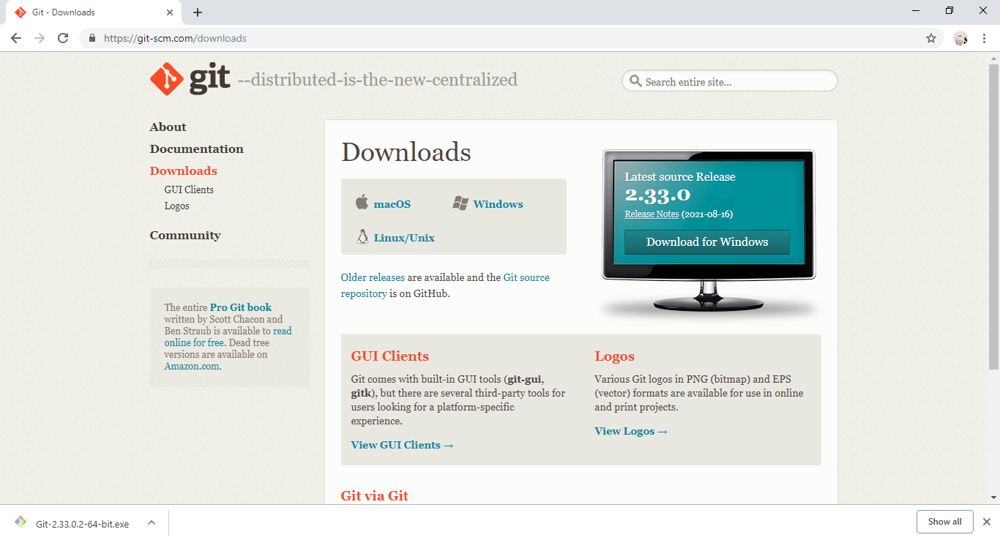

3. Jika proses download telah selesai, lakukan instalasi pada komputer atau laptop Anda.

4. Double klik pada file yang telah didownload dan akan ditampilkan lisensi. Kemudian klik **Next**.

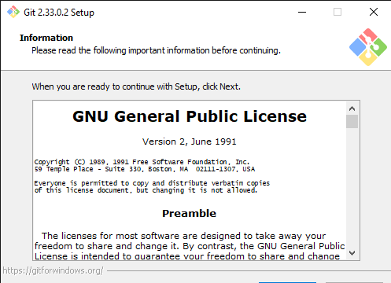

5. Pilih tempat tujuan untuk menyimpan file git Anda. Kemudian klik **Next**.

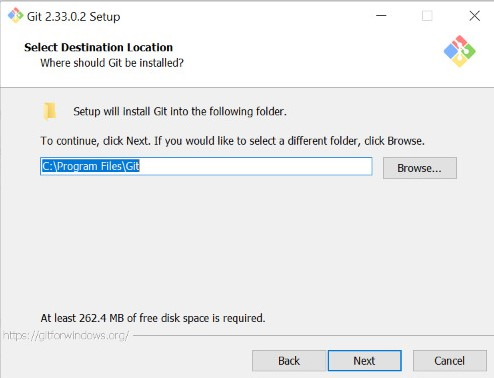

6. Pilih komponen. Pada komponen ini tidak ada yang perlu diubah. Langsung saja klik **Next**.

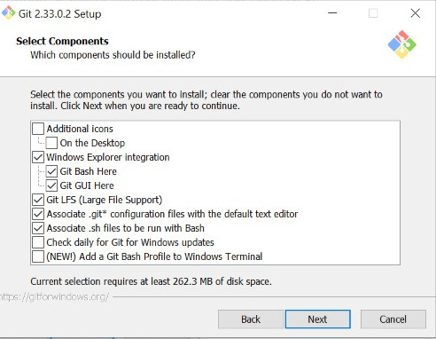

7. Isi shortcut untuk menu start. Gunakan default (GIT). Kemudian klik **Next**.

8. Pilih editor yang akan digunakan, bisa menggunakan visual studio code, note++, maupun vim. Kemudian klik **Next**.

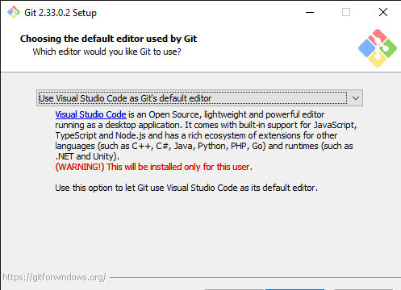

9. Pada bagian *Adjusting the name of the initial branch in new respositories* pilih *Let Git decide*. Kemudian klik **Next**.

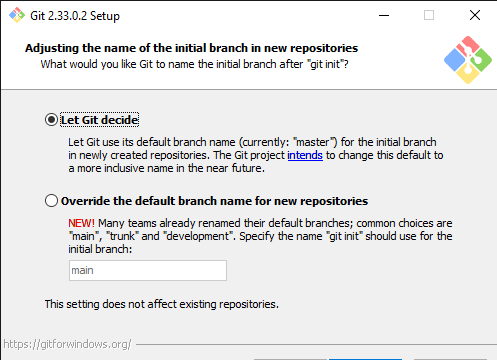

10. Kemudian di bagian penyesuaian PATH environment pilih *Git from the command line and also from 3rd-party software* yang sudah direkomaendasikan. Kemudian klik **Next**.

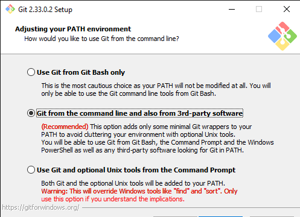

11. Pada bagian *Choosing the SSH executable* pilih *Use bundled OpenSSH*. Kemudian klik **Next**.

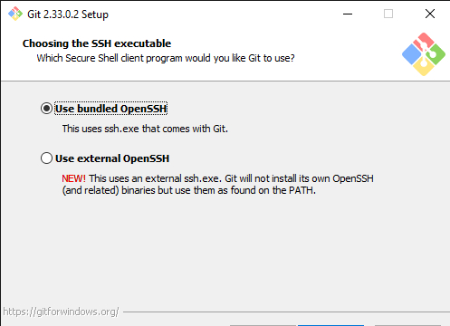

12. Kemudian di bagian *Choosing HTTPS transport backend* pilih *Use the OpenSSL library*. Kemudian klik **Next**.

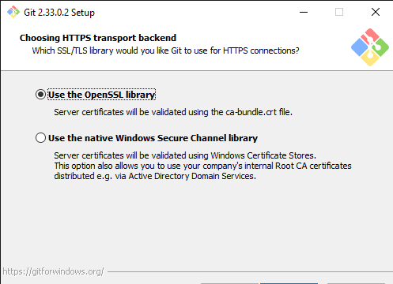

13. Kemudian di bagian konfigurasi *line ending* pilih yang *Checkout Windows-Style, commit Unix-style line endings*. Kemudian klik **Next**.

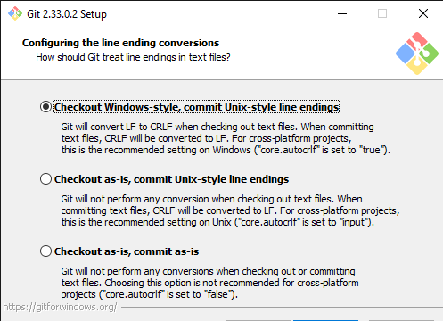

14. Pilih *Use MinTTY* pada konfigurasi terminal emulator. Kemudian klik **Next**.

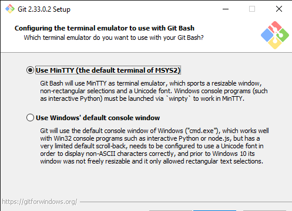

15. Pilih *Default* pada bagian *default behavior of 'git pull'*. Kemudian klik **Next**.

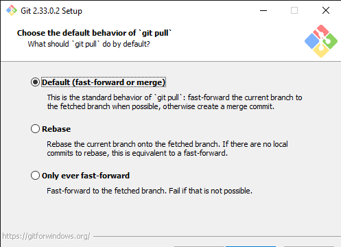

16. Pada *credential helper* pilih *Git Creential Manager Core*. Kemudian klik **Next**.

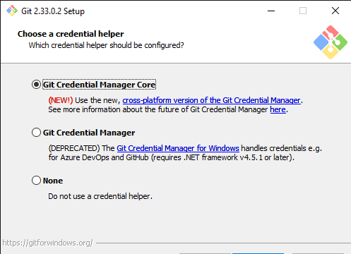

17. Pada bagian *Configuring experimental options* beri **checklist** pada dua pilihan tersebut. Kemudian klik **Install**.

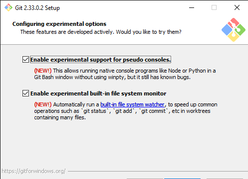

16. Setelah instalasi selesai, Klik **Finish** dan cek melalui comandprompt pada windows untuk mengecek status instalasi sudah berhasil atau belum dengan menuliskan **git --version** kemudian klik enter. Jika muncul *git version 2.33.0.windows.2* (sesuai versi yang didownload), maka proses intalasi sudah berhasil.

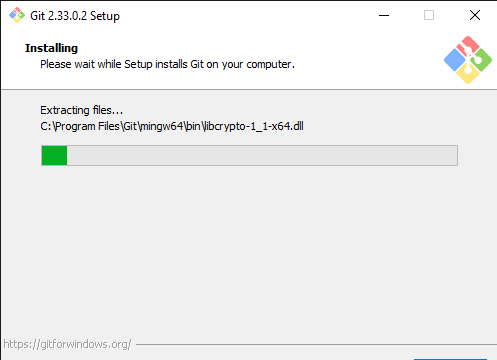

17. Tampilan Git Bash

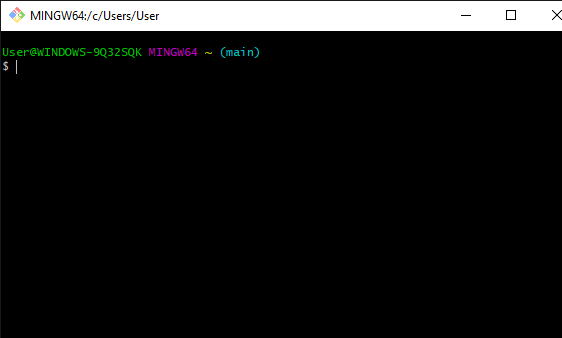

## Konfigurasi Git

1. Buka Git Bash. Cari melalui start kemudian ketik Git, pilih Git Bash.
2. Ketikkan `$ git config --global user.name *nama user github*`. Kemudian klik enter.

3. ketikkan `$ git config --global user.email *emailanda@gmail.com*`. Kemudian klik enter.

4. Untuk melihat konfigurasi yang sudah ada ketikkan `$ git config --list`. Kemudian klik enter.

## Mengelola Repo
### Membuat Repo Pribadi
1. Klik tanda + pada bagian atas setelah login.

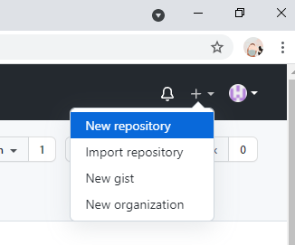

2. Isikan nama repository, isi deskripsi repo (optional), jika dikehendaki bisa dibuat repo **private**,

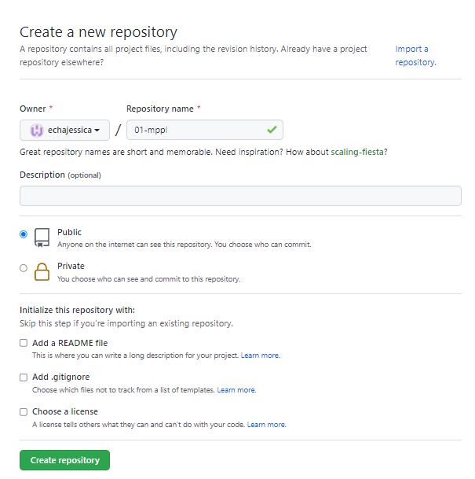

3. Klik `create repository`.

### Membuat Clone

1. Buka komputer lokal dan pilih tempat tujuan penyimpanan Repo.

2. klik kanan di tempat yang kosong kemudian pilih *Git Bash Here* 

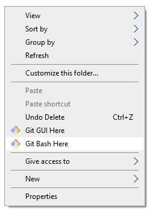

3. Setelah itu ketikkan perintah `$ git clone https://github.com/echajessica/01-git-github.git` kemudian enter dan akan muncul seperti ini.

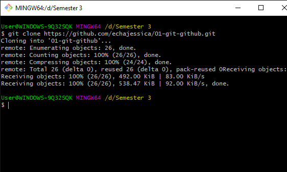

4. Selanjutnya akan muncul folder yang sama dengan repository yang sudah dibuat.

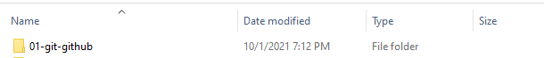

### Membuat File di Dalam Repo

1. Klik kanan folder hasil clone tadi dan pilih *git bash here*.

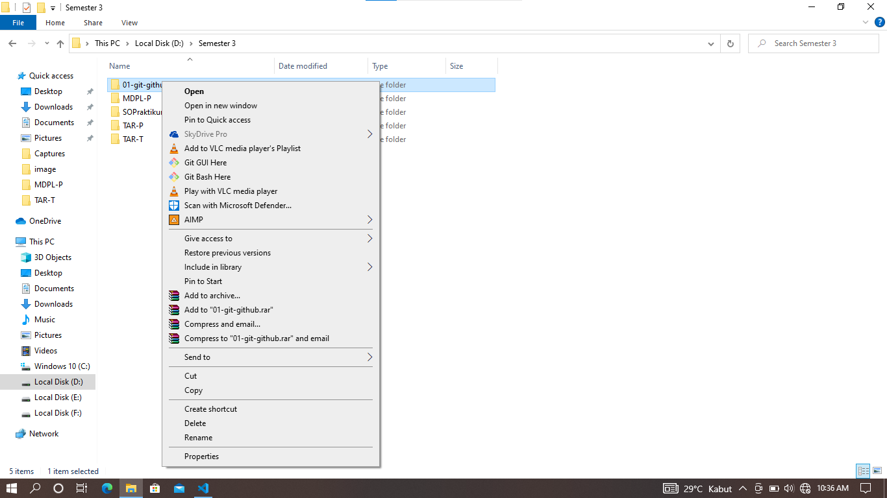

2. Setelah itu buat file README.md menggunakan perintah `$ echo " # 01-git-github " >> README.md`

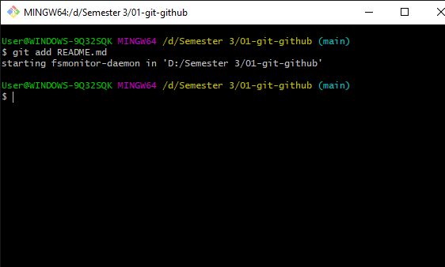

3. Jika berhasil, file README.md akan muncul di dalam folder yang telah dibuat

4. Gunakan perintah `$ git init` untuk melakukan inisialisasi dalam direktori

5. Kemudian ketikkan `$ git add README.md` untuk membuat file README.md

6. Lanjut dengan perintah `$ git commit -m "first commit"` untuk memberikan informasi update.

7. Selanjutnya tuliskan perintah `$ git branch -M main` untuk membuat perubahan git lokal karena tadi masih menggunakan istilah master.

8. Langkah selanjutnya adalah mengetikkan perintah `$ git remote add origin https://github.com/echajessica/01-git-github.git` yang berfungsi untuk mengupload file yang sudah di buat di dalam komputer.

9. Ketikkan `$ git push -u origin main` untuk upload ke github, kemudian klik enter.

10. Buka file README.md kemudian edit isinya.

### Mengupload File

1. Untuk upload file yang sudah diedit tadi gunakan perintah `$ git status` untuk melihat status file tersebut. Sebelumnya klik kanan pada folder yang berisi file README.md tersebut kemudian klik *Git Bush Here*

2. Gunakan perintah `$ git add README.md`

3. Cek statusnya kembali dengan `$ git status` 

4. Setelah semuanya langkahnya terpenuhi, gunakan perintah `$ git commit -m "first commit"` untuk membuat deskripsi atau informasi terkait file yang diupload atau diupdate.

5. Untuk mengupload atau mengupdatenya gunakan perintah `$ git push`

6. Refresh akun github dan file yang diupload tadi otomatis sudah masuk ke github.