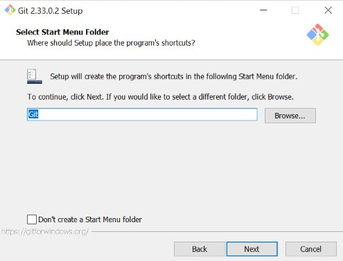

# 01-git-github
## Langkah-langkah untuk menginstall git di windows
1. Pastikan Anda sudah menginstall text editor seperti vscode, note++, maupun vim

2. Download git di https://git-scm.com/downloads

3. Jika proses download telah selesai, lakukan instalasi pada komputer atau laptop Anda.

4. Double klik pada file yang telah didownload dan akan ditampilkan lisensi. Kemudian klik **Next**.

5. Pilih tempat tujuan untuk menyimpan file git Anda. Kemudian klik **Next**.

6. Pilih komponen. Pada komponen ini tidak ada yang perlu diubah. Langsung saja klik **Next**.

7. Isi shortcut untuk menu start. Gunakan default (GIT). Kemudian klik **Next**.

8. Pilih editor yang akan digunakan, bisa menggunakan visual studio code, note++, maupun vim. Kemudian klik **Next**.

9. Pada bagian *Adjusting the name of the initial branch in new respositories* pilih *Let Git decide*. Kemudian klik **Next**.

10. Kemudian di bagian penyesuaian PATH environment pilih *Git from the command line and also from 3rd-party software* yang sudah direkomaendasikan. Kemudian klik **Next**.

11. Pada bagian *Choosing the SSH executable* pilih *Use bundled OpenSSH*. Kemudian klik **Next**.

12. Kemudian di bagian *Choosing HTTPS transport backend* pilih *Use the OpenSSL library*. Kemudian klik **Next**.

13. Kemudian di bagian konfigurasi *line ending* pilih yang *Checkout Windows-Style, commit Unix-style line endings*. Kemudian klik **Next**.

14. Pilih *Use MinTTY* pada konfigurasi terminal emulator. Kemudian klik **Next**.

15. Pilih *Default* pada bagian *default behavior of 'git pull'*. Kemudian klik **Next**.

16. Pada *credential helper* pilih *Git Creential Manager Core*. Kemudian klik **Next**.

17. Pada bagian *Configuring experimental options* beri **checklist** pada dua pilihan tersebut. Kemudian klik **Install**.

16. Setelah instalasi selesai, Klik **Finish** dan cek melalui comandprompt pada windows untuk mengecek status instalasi sudah berhasil atau belum dengan menuliskan **git --version** kemudian klik enter. Jika muncul *git version 2.33.0.windows.2* (sesuai versi yang didownload), maka proses intalasi sudah berhasil.

17. Tampilan Git Bash

18. Tampilan Git UI

## Konfigurasi Git

1. Buka Git Bash. Cari melalui start kemudian ketik Git, pilih Git Bash.
2. Ketikkan `$ git config --global user.name *nama user github*`. Kemudian klik enter.

3. ketikkan `$ git config --global user.email *emailanda@gmail.com*`. KKemudian klik enter.

4. Untuk melihat konfigurasi yang sudah ada ketikkan `$ git config --list`. Kemudian klik enter.

## Mengelola Repo
### Membuat Repo Pribadi
1. Klik tanda + pada bagian atas setelah login.

2. Isikan nama repository, isi deskripsi repo (optional), jika dikehendaki bisa dibuat repo **private**,

3. Klik `create repository`.